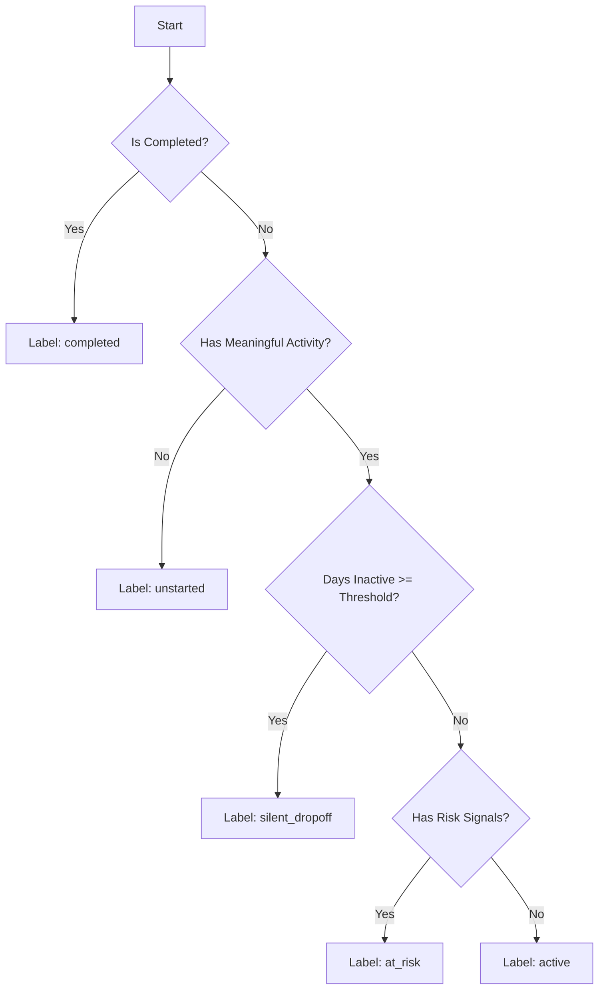

# Labeling Logic

Owner: Shaswath

## Purpose

This document defines how each learner-course record is labeled for analysis. These labels segment learners into distinct states to support behavior driver analysis and prioritize mentor outreach.

## Output Grain

- **Grain**: One row per learner-course enrollment (`learner_id`, `course_id`).

## Labeling Definitions & Rules

To prevent overlap and ensure deterministic assignment, labels are evaluated sequentially in the priority order defined below.

### 1. completed
A learner has successfully finished the course.
- **Criteria** (Any of the following):
  - `completion_status` is one of: `'completed'`, `'complete'`, `'passed'`, or `'certified'` (case-insensitive).
  - `completion_date` is not null and not empty.
  - `progress_percent` is $\ge$ 90% (normalized value $\ge 0.90$).

### 2. unstarted
A learner has enrolled but has not performed any meaningful course activity.
- **Criteria**: No meaningful activity is recorded. Meaningful activity is defined as:
  - `total_sessions > 0` OR
  - `quiz_attempt_count > 0` OR
  - `progress_percent > 0`

### 3. silent_dropoff
A learner was active previously but has stopped participating, showing no activity for an extended duration.
- **Criteria**:
  - Must not be `completed`.
  - Must have meaningful earlier activity (i.e. not `unstarted`).
  - `days_since_last_activity >= inactivity_threshold_days` (Default: **21 days**).

### 4. at_risk
A learner is currently active or recently inactive but exhibits behavioral warning signs that predict potential drop-off.
- **Criteria** (Must not be `completed`, `unstarted`, or `silent_dropoff`, and any of the following is true):
  - **Academic Challenge**: The latest quiz score is low (`latest_quiz_score < 50` out of 100).
  - **Activity Gap**: Inactivity is growing (`days_since_last_activity >= max(10, inactivity_threshold_days // 2)`). With the default threshold of 21 days, this triggers at $\ge 10$ days.
  - **Stalled Progress**: The learner has low progress ($< 50\%$) and has been inactive for $\ge 10$ days.

### 5. active
A learner is engaged and progressing through the course normally.
- **Criteria**: Any learner who is not `completed`, `unstarted`, `silent_dropoff`, or `at_risk`.

---

## Evaluation Order (Priority)

Labels must be resolved in this exact sequence:

---

## Critical Blockers & Warnings

> [!WARNING]
> **Data Availability Requirements**:
> The feature pipeline relies on specific aggregate fields from the data engineering stage. If any of the following fields are absent from the input:
> - `completion_status`, `completion_date`, or `progress_percent`: **completed** labels cannot be computed.
> - `latest_activity_date` or `days_since_last_activity`: **silent_dropoff** and **at_risk** labels cannot be computed.
> - `latest_quiz_score`: **at_risk** academic challenge signals cannot be identified.
>
> If these fields are missing, the pipeline will fallback to safe defaults (e.g. treating them as 0 or empty) to prevent system failure, but the resulting labels will be inaccurate. This should be treated as a pipeline blocking issue.
